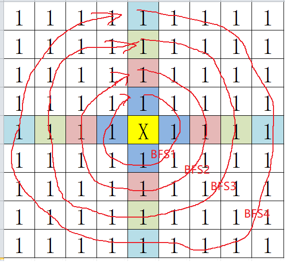
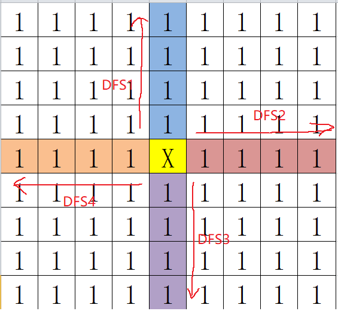

# 1 DFS
## **1.1 LeetCode定义**  
深度优先搜索算法是一种用于遍历或搜索**树**或**图**的算法。沿着树的深度遍历树的节点，尽可能深的搜索树的分支。当前节点v的所有边都已被探寻过，搜索将回溯到发现节点v的那条边的起始节点。这一过程一直进行到已发现从源节点可达的所有节点。如果还存在未发现的节点，则选择其中一个节点作为源节点并重复以上过程，整个遍历进程反复进行直到所以节点都被访问到为止。
## **1.2 算法框架**  
```c++
/* 遍历树，递归实现 */
void dfs(TreeNode *node){
    // 1.触底返回
    if (node == nullptr) {
        return;
    }
    // 2.处理当前节点
    /* 常见做法：a.检查当前节点值; b.记录路径; */

    // 3.继续深入遍历
    dfs(node->left);
    dfs(node->right);
}

/* 遍历树，栈实现 */
void dfs(TreeNode *node) {
    // node判空
    stack<TreeNode*> st;

    // 1.根节点入栈
    st.push(root);
    while (!st.empty()){
        TreeNode *node = st.top();
        if (node->left == nullptr && node->right == nullptr){
            // 2.当前节点为叶子节点，处理完叶子节点之后出栈
            node->val ....
            st.pop();
        }
        // 3.非叶子节点，将节点入栈，继续深入遍历
        if (node->left != nullptr){
            st.push(st->left);
        }
        if (node->right != nullptr){
            st.push(st->right);
        }
    }

}

/* 遍历图（矩阵），递归实现 */
void dfs(vector<vector<int>>& matrix, int i, int j){
    // 1.如果已经访问或者满足某种特定条件，返回
    if (isVisted(matrix[i][j]) || isValid(matrix[i][j])) {
        return;
    }

    // 2.将当前节点标记成已访问状态，有多种标记方法，如原地标记，新开数组标记等。
    visted(matrix[i][j]);

    // 3.继续遍历周边节点
    for(auto ni, nj : dir[]){
        dfs(matrix, i+ni, j+nj);
    }

}
```
## **1.3 常见题型**
### 1.3.1 树遍历
- [1302.层数最深叶子节点的和](https://leetcode-cn.com/problems/deepest-leaves-sum/)  
    思路：a.题目描述可翻译成求二叉树的最大深度；b.遍历到子节点时更新最大深度，如果有多个最大深度相等的节点，则将它们的值累加；c.在退出每一个子节点时都需要**回溯**，即减去子节点的深度；
- [面试题04.12.求和路径](https://leetcode-cn.com/problems/paths-with-sum-lcci/)  
    思路：DFS＋回溯  

- [1376.通知所有员工所需的时间](https://leetcode-cn.com/problems/time-needed-to-inform-all-employees/)  
    思路：a.此问题可以转化成树的遍历，通知所有员工所需的分钟数，实际上就是从根节点遍历到叶子节点做需要的最大时间数；所以遍历方法可以使用**DFS**；b.在遍历经过每一个节点时需要记录所花费的时间，在到达叶子节点时计算从根节点到该叶子节点的总时间，更新最大时间变量；c.因为需要计算所有叶子节点的时间，所以在遍历完一个叶子节点之后，要转到遍历其他的叶子节点，所以需要用到**回溯**，从叶子节点退回到父节点时需要减去到达该叶子节点的时间；d.在开始遍历整棵树之前，先通过一次完整的遍历将每个节点有多少个子节点的信息记录下来，避免在遍历树的过程中才去收集这些信息；  
#### **套路总结**
这类题型最主要的难点在于，怎么将题目的描述理解成对树的遍历，怎样构造出一颗树。解决的方法可以通过手动对题目给出的用例进行模拟，将模拟的过程在草稿纸上写出来。写完之后如果是一棵树，说明该题实际上就是对树进行遍历；

### 1.3.2 矩阵遍历
- [130.被围绕的区域](https://leetcode-cn.com/problems/surrounded-regions/)  
    思路：第一次遍历，从边界上的O开始DFS，找出并标记(用#填充)所有和边界O相连的O。第二次全遍历，将未标记的O(和边界O不相连)用X填充。  

- [200.岛屿数量](https://leetcode-cn.com/problems/number-of-islands/)  
    思路：计算岛屿的数量，前提是要计算出每一个岛屿的范围。以每个岛节点作为根节点进行DFS，即可扩散出每一个岛屿最大的范围，在扩散的过程中需要标记每一个访问过的岛，防止重复访问(此题中将访问过的1写成0)。能够找到的根节点的数量就是岛屿的数量。  
      
- [417.太平洋大西洋水流问题](https://leetcode-cn.com/problems/pacific-atlantic-water-flow/)  
    思路：暴力的以每一个节点作为根节点进行DFS，会遍历到很多无效的路径（无法同时到达大西洋和太平洋）。逆向思维，从到达大西洋和太平洋的节点反向DFS，这样遍历出来的节点都是可以到达海洋的节点，选同时可以到达两个海洋的节点便是题目的答案。
- [529.扫雷游戏](https://leetcode-cn.com/problems/minesweeper/)  
    思路：a.从输入的点开始DFS，找到M立即停止，找到E则计算周围节点是否有炸弹，有则将炸弹数量记录下来，没有则继续对E周围的节点进行扩散DFS; b.DFS停止的条件：找到M，或者找不到周围全是空白的节点；
- [841.钥匙和房间](https://leetcode-cn.com/problems/keys-and-rooms/)  
    思路：  todo...

#### **套路总结**  
题目给出矩阵,需要按某种条件在矩阵中进行**扩散**得到答案，其遍历方法一般就是**DFS/BFS+Visited数组**了，在构建算法框架的过程中需要思考几个问题：  
- (1)选哪些点作为DFS的根节点？
- (2)DFS结束的条件是谁什么？
- (3)从当前节点怎么扩散到周围的邻接节点？
- (4)怎么标记已访问的节点？(visited数组怎么组织？)

### 1.3.3 图的遍历

# 2 BFS
## **2.1 定义**
BFS是逐层遍历，当遍历停止时会同时得到左右的遍历结果。
## **2.2 算法框架**
```c
/* BFS算法的实现需要借助数据结构"队列" */

/* 遍历树 */
void bfs(TreeNode *node){
    // 1.创建队列
    queue<TreeNode *node> q;

    // 2.根节点入队
    q.push(node);

    while (!q.empty()){
        int qSize = q.size();
        // 3.逐层遍历
        while (qSize){
            qSize--;
            TreeNode *node = q.front();
            q.pop();
            // 4.处理当前节点
            // node->val

            // 5.下一层的子节点入队
            if (node->left != nullptr) {
                q.push(node->left);            
            }
            if (node->right ！= nullptr) {
                q.push(node->right);
            }
        }
    }
}

/* 矩阵遍历 */
void bfs(vector<vector<int>>& matrix, int r, int c){
    // 1.创建队列
    queue<int>&> q;

    // 2.源节点入队
    q.push(matrix[r][c];

    while (!q.empty()) {
        int qSize = q.size();
        // 3.逐层遍历
        while (qSize) {
            qSize--;
            int node = q.front();
            q.pop();
            // 4.处理当前节点
            //node ...

            // 5.将下一层的节点入队
            for(auto e : node->neighborhood) {
                q.push(e);
            }
        }
    }
}
```
**Tips**  使用DFS和BFS遍历矩阵的区别：  
  

## **2.3 常见题型**
### 2.3.1 树遍历
- [102.二叉树的层序遍历](https://leetcode-cn.com/problems/binary-tree-level-order-traversal/)  
    思路：使用BFS逐层遍历二叉树，每层遍历结束时输出遍历结果。
    ```c
    class Solution {
    public:
        vector<vector<int>> levelOrder(TreeNode* root) {
            if (!root) return {};
            vector<int> sub;
            vector<vector<int>> ans;
            // 1.创建队列
            queue<TreeNode*> q;
            // 2.根节点入队
            q.push(root);

            while (!q.empty()) {
                int qSize = q.size();
                // 3.逐层遍历
                for (int i = 0; i < qSize; ++i) {
                    TreeNode* node = q.front();
                    q.pop();
                    // 4.输出当前层的节点
                    sub.push_back(node->val);
                    // 5.下一层节点入队
                    if (node->left) q.push(node->left);
                    if (node->right) q.push(node->right);
                }
                ans.push_back(sub);
                sub.clear();
            }
            return ans;
        }
    };
    ```   
- [752.打开转盘锁](https://leetcode-cn.com/problems/open-the-lock/)  
    思路：a.每个拨轮每次可以往上或者往下拨动，即拨轮当前数字加1或者减1，整个转盘锁4个拨轮，所以转盘锁的下一个状态总共有2*4=8种情况。如下图所示，根据手动模拟可以发现从"0000"状态到target状态的遍历是逐层进行的，所以自然就想到了使用BFS。b.没深入遍历一层，时间+1；c.遍历停止条件：新状态到达target; d.已访问状态标记方法？e.注意在遍历每一层的8个状态的代码实现细节。  
      
#### **套路总结**

### 2.3.2 矩阵遍历
- [1162.地图分析](https://leetcode-cn.com/problems/as-far-from-land-as-possible/)  
    思路：以陆地作为源节点向海洋BFS扩散，每扩散一圈距离加1，扩散过程中访问过的海洋都标成陆地，扩散结束时即可得到最远距离；
- [909.蛇梯棋](https://leetcode-cn.com/problems/snakes-and-ladders/)  
    思路：

### 3.3.3 图遍历