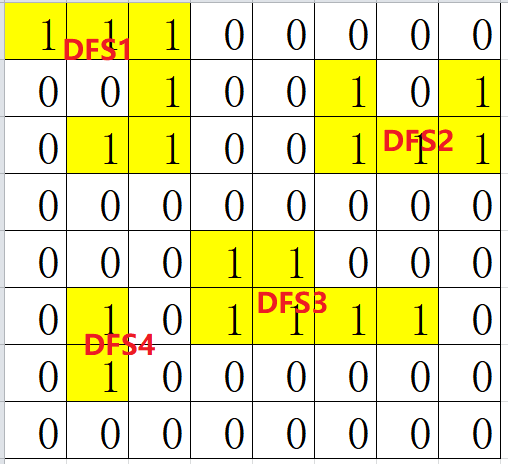

# 1 DFS
## **1.1 LeetCode定义**  
深度优先搜索算法是一种用于遍历或搜索**树**或**图**的算法。沿着树的深度遍历树的节点，尽可能深的搜索树的分支。当前节点v的所有边都已被探寻过，搜索将回溯到发现节点v的那条边的起始节点。这一过程一直进行到已发现从源节点可达的所有节点。如果还存在未发现的节点，则选择其中一个节点作为源节点并重复以上过程，整个遍历进程反复进行直到所以节点都被访问到为止。
## **1.2 算法框架**  
```c++
/* 遍历树，递归实现 */
void dfs(TreeNode *node){
    // 1.触底返回
    if (node == nullptr) {
        return;
    }
    // 2.处理当前节点
    /* 常见做法：a.检查当前节点值; b.记录路径; */

    // 3.继续深入遍历
    dfs(node->left);
    dfs(node->right);
}

/* 遍历树，栈实现 */
void dfs(TreeNode *node) {
    // node判空
    stack<TreeNode*> st;

    // 1.根节点入栈
    st.push(root);
    while (!st.empty()){
        TreeNode *node = st.top();
        if (node->left == nullptr && node->right == nullptr){
            // 2.当前节点为叶子节点，处理完叶子节点之后出栈
            node->val ....
            st.pop();
        }
        // 3.非叶子节点，将节点入栈，继续深入遍历
        if (node->left != nullptr){
            st.push(st->left);
        }
        if (node->right != nullptr){
            st.push(st->right);
        }
    }

}

/* 遍历图（矩阵），递归实现 */
void dfs(vector<vector<int>>& matrix, int i, int j){
    // 1.如果已经访问或者满足某种特定条件，返回
    if (isVisted(matrix[i][j]) || isValid(matrix[i][j])) {
        return;
    }

    // 2.将当前节点标记成已访问状态，有多种标记方法，如原地标记，新开数组标记等。
    visted(matrix[i][j]);

    // 3.继续遍历周边节点
    for(auto ni, nj : dir[]){
        dfs(matrix, i+ni, j+nj);
    }

}
```
## **1.3 常见题型**
### 1.3.1 二叉树遍历

### 1.3.2 矩阵遍历
- [130.被围绕的区域](https://leetcode-cn.com/problems/surrounded-regions/)  
    思路：第一次遍历，从边界上的O开始DFS，找出并标记(用#填充)所有和边界O相连的O。第二次全遍历，将未标记的O(和边界O不相连)用X填充。
- [200.岛屿数量](https://leetcode-cn.com/problems/number-of-islands/)  
    思路：计算岛屿的数量，前提是要计算出每一个岛屿的范围。以每个岛节点作为根节点进行DFS，即可扩散出每一个岛屿最大的范围，在扩散的过程中需要标记每一个访问过的岛，防止重复访问(此题中将访问过的1写成0)。能够找到的根节点的数量就是岛屿的数量。
      
- [417.太平洋大西洋水流问题](https://leetcode-cn.com/problems/pacific-atlantic-water-flow/)  
    思路：暴力的以每一个节点作为根节点进行DFS，会遍历到很多无效的路径（无法同时到达大西洋和太平洋）。逆向思维，从到达大西洋和太平洋的节点反向DFS，这样遍历出来的节点都是可以到达海洋的节点，选同时可以到达两个海洋的节点便是题目的答案。
#### **套路总结**  
题目给出矩阵,需要按某种条件在矩阵中进行扩散得到答案，其遍历方法一般就是**DFS/BFS+Visited数组**了，在构建算法框架的过程中需要思考几个问题：  
- (1)选哪些点作为DFS的根节点？
- (2)DFS结束的条件是谁什么？
- (3)从当前节点怎么扩散到周围的邻接节点？
- (4)怎么标记已访问的节点？(visited数组怎么组织？)

### 1.3.3 图的遍历

# 2 BFS