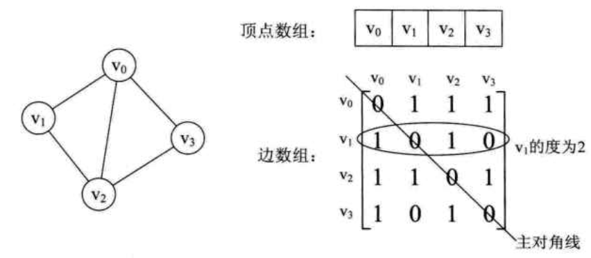
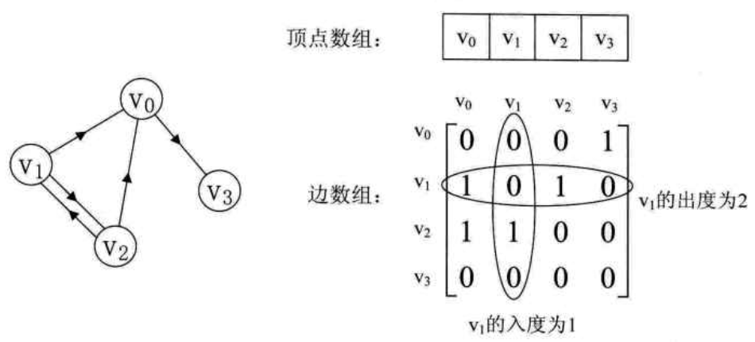
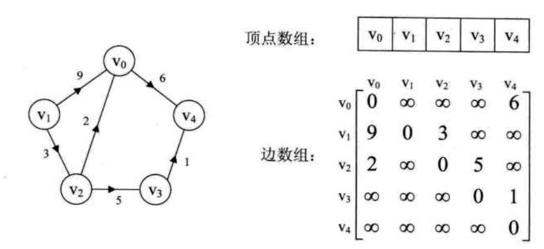
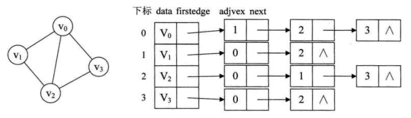
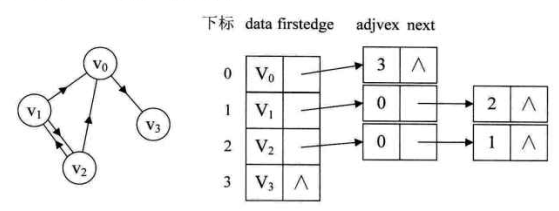
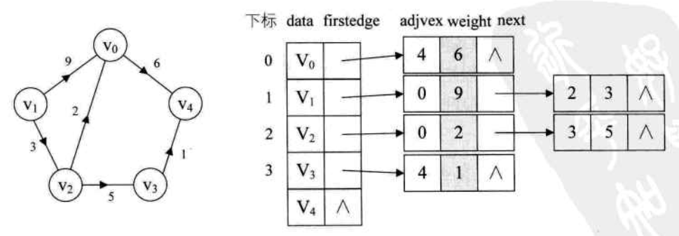
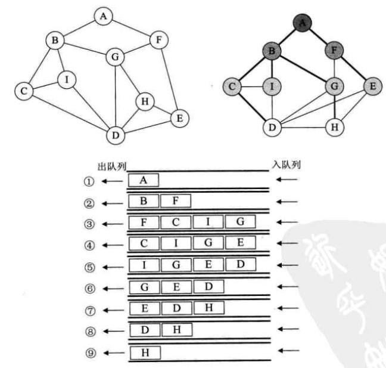
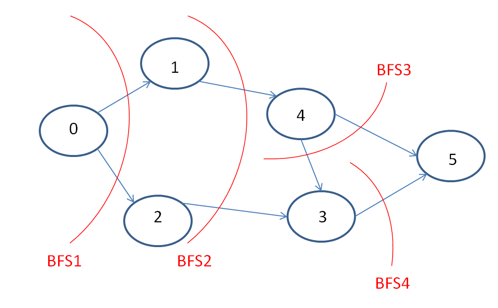

# **1 图的表示方法**
[转载](https://www.cnblogs.com/KBryant/p/11616218.html)
## **1.1 邻接矩阵表示法**
表示定点之间邻接关系的矩阵。
- 无向图邻接矩阵  
(1)无向图的邻接矩阵为对称矩阵，可以压缩存储。有n个节点的无向图需要的存储空间为n(n-1)/2;
(2)无向图中，定点Vi的度是邻接矩阵中第i行元素之和；  
  

- 有向图(无权)的邻接矩阵  
      
(1)有向图的邻接矩阵不一定对称，有n个定点的有向图需要的存储空间为n^2;   
(2)有向图中，定点Vi的**出度**是邻接矩阵中**第i行**元素之和，顶点Vi的**入度**是邻接矩阵中**第i列**的元素之和；  

- 带权有向图的邻接矩阵  
  

- 邻接矩阵的数据类型定义  
```c
#define MaxVertexNum 100    // 顶点数目最大值

typedef char VertexType     // 顶点数据类型
typedef int EdgeType        // 带权图中边上权值的数据类型，如果只是表示边是否存在，可以定义为0/1的枚举类型
typedef struct {
    VertexType vex[MaxVertexNum];               // 顶点表
    EdgeType edge[MaxVertexNum][MaxVertexNum];  // 邻接矩阵，n^2存储空间
    int curVex;                                 // 当前顶点
    int curArc;                                 // 弧数 ？
}MGraph
```
## **1.2 邻接表表示法**
(1)图中顶点用一个一维数组存储。顶点数组中，每个元素还需要存储一个指向第一个邻接节点的指针，以便于查找该顶点的边信息；  
(2)图中每个顶点Vi的所有邻接节点构成一个线性表，由于邻接节点的数目不定，所以该线性表使用单链表来存储。  
(3)该线性表在无向图中称为**顶点Vi的边表**，在有向图中称为**顶点Vi作为弧尾的出边表**;
- 无向图的邻接表  

- 无权有向图的邻接表  

- 带权有向图的邻接表   
  

- 邻接表的数据类型表示  
```c
#define MaxVertexNum 100    // 顶点数目最大值

typedef char VertexType 
typedef int EdgeType
/* 边 */
typedef struct {            
    int adjVex;             // 该弧所指向的顶点的位置
    struct ArcNode *next;   // 指向下一条弧的指针
    //WeightType weight;      // 带权图的边的权值
} ArcNode;
/* 节点 */
typedef struct{
    VertexType data;    // 顶点信息
    ArcNode *first;     // 指向第一条依附该顶点的弧的指针
}VNode, AdjList[VertexNum]; // 节点，邻接表

/* 用邻接表表示的图 */
typedef struct {
    AdjList vertices;   // 邻接表
    int verNum;         // 顶点数
    int arcNum;         // 弧数
}ALGraph;
```

# **2 图的遍历**
[转载](https://www.cnblogs.com/KBryant/p/11617232.html)
## **2.1 BFS遍历**
- 过程分析  

(1)初始化一个队列。访问A顶点，将A顶点入队，之后出队。同时将与A顶点相邻接的顶点B，F入队;  
(2)访问B结点，将B结点出队，同时将与B结点相邻接，且还未被访问过的顶点C，I，G入队;  
(3)访问F结点，将F结点出队，同时将于F结点相邻接，且还未被访问过的顶点G，E入队。之后同理，直到队列为空。所得的出队序列就是遍历序列

- 代码实现  
```c
#define MaxVertexNum 100    // 顶点数目最大值

bool visited[MaxVertexNum];        //访问标记数组
//邻接矩阵的广度遍历算法
void BFSTraverse(MGraph G)
{
    Queue Q;    //辅助队列
    for (int i = 0; i < G.vexnum; i++)
    {
        visited[i] = false;    //访问标记数组初始化
    }
    InitQueue(Q);    //初始化辅助队列
    for (int i = 0; i < G.vexnum; i++)    //从0号顶点开始遍历
        if (!visited[i])    //对每个连通分量调用一次BFS
            BFS(G, i);    //Vi未访问过，从Vi开始BFS
}

void BFS(MGraph G, int v)
{
    //从顶点v出发，广度优先遍历图G，算法借助一个辅助队列Q
    visit(v);    //访问结点v
    visited[v] = true;    //对v做访问标记
    Enqueue(Q, v);        //顶点v入队列
    while (!isEmpty(Q))
    {
        Dequeue(Q, v);        //顶点v出队
        for (int w = FirstNeighbor(G, v); w >= 0; w = NextNeighbor(G, v, w))//检测v所有的邻接点
        {
            if (!visited[w])    //w为v还未访问过的邻接结点
            {
                visit(w);    //访问顶点w
                visited[w] = true;    //对顶点w做访问标记, 或者直接删除已经遍历过的节点
                Enqueue(Q, w);        //将顶点w入队
            }
        }
    }
}
```
## **2.2 DFS遍历**
- 过程分析  
(1)首先访问图中某一起始顶点v，然后由v出发，访问与v邻接且未被访问的任一顶点w1，再访问与w1邻接且未被访问的任一顶点w2;
(1)重复上述过程。当不能再继续访问的时候，依次退回到最近被访问的顶点，若它还有邻接顶点未被访问过，则从该顶点开始继续上述搜索过程，直到图中所有顶点均被访问过为止;

- 代码实现  
```c
/*深度优先遍历算法*/
bool visited[MaxVertexNum];        //访问标记数组
void DFSTraverse(MGraph G)
{
    for (int v = 0; v < G.vexnum; ++v)
        visited[v] = false;        //初始化访问标记数组
    for (int v = 0; v < G.vexnum; ++v)    //从顶点0开始遍历
    {
        if (!visited[v])        //顶点v还问访问过，则访问
            DFS(G, v);
    }
}

void DFS(MGraph G, int v)
{
    //从顶点v出发，采用递归思想，深度优先遍历图
    visit(v);
    visited[v] = true;
    for (int w = FirstNeighbor(G, v); w >= 0; w = NextNeighbor(G, v, w))//检测v所有的邻接点
        if (!visited[w])
        {
            DFS(G, w);
        }
}
```

# **3 常见题型**
- [207.课程表](https://leetcode-cn.com/problems/course-schedule/)  
    思路：  
    a.题目的描述可以翻译成一个有向无权的图，输入的边[end, start]的集合；  
    b.根据示例，判断课程是否可以学完，只需要判断图中是否存在环即可；  
    c.判断有向无权图是否存在环的方法一般使用**拓扑排序**，遍历的算法是BFS，如果图中存在环，则BFS能够遍历的节点数必定会少于图的总结点数(因为成环的节点其入度永远不会减到0)；  
      
```c
	bool canFinish(int numCourses, vector<vector<int>>& prerequisites) {
		vector<vector<int>> G(numCourses); // 邻接矩阵
		vector<int> inDegree(numCourses, 0); // 记录每个顶点的入度

		// 1.邻接矩阵初始化，入度初始化
		for (int i = 0; i < prerequisites.size(); i++) {
			int start = prerequisites[i][1];
			int end = prerequisites[i][0];
			G[start].push_back(end); // start --> end
			inDegree[end]++;		 // 终点指向end的边的个数
		}

		int num = 0; // 记录遍历过的节点数

		queue<int> q;
		// 2.将入度为0的节点入队
		for (int i = 0; i < inDegree.size(); i++) {
			if (inDegree[i] == 0) {
				q.push(i);
			}
		}

		// 3.逐层遍历、删除入度为0的节点，并对下一层入度减1，将入度为0的节点继续入队
		while (!q.empty()) {
			int u = q.front();
			q.pop();

			// 4. 遍历u节点的邻接节点，将邻接节点的入度减1， 将入度为0的邻接节点入队，进入下一轮遍历
			for (int i = 0; i < G[u].size(); i++) {
				int v = G[u][i];
				inDegree[v]--;
				if (inDegree[v] == 0) {
					q.push(v);
				}
			}

			num++; // 统计遍历过的节点数
			G[u].clear(); // 删除当前节点
		}
		
		// 5.判断遍历过的节点是否等于图的总节点数
		if (num == numCourses) {
			return true;
		}

		return false;
	}
```

- [210.课程表II](https://leetcode-cn.com/problems/course-schedule-ii/)  
    思路：
  